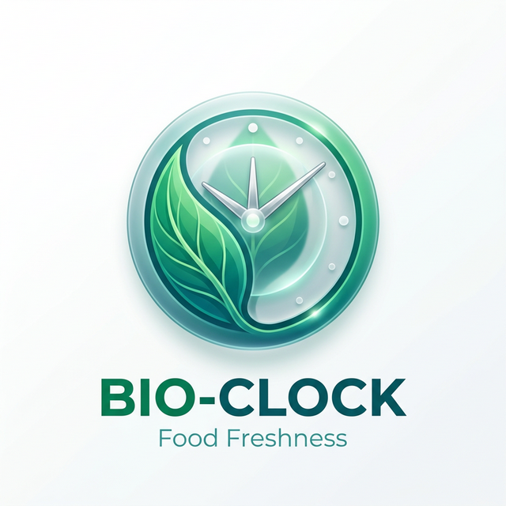

<p align="center">
  
</p>

<h1 align="center">🧬 Bio-Clock</h1>

<p align="center">
  <strong>Predictive Food Spoilage Intelligence — Powered by Amazon Nova Pro</strong>
</p>

<p align="center">
  <a href="#-mission">Mission</a> •
  <a href="#-technical-stack">Stack</a> •
  <a href="#-zero-cors-architecture">Zero-CORS Fix</a> •
  <a href="#-project-structure">Structure</a> •
  <a href="#-getting-started">Getting Started</a>
</p>

---

## 🎯 Mission

**Bio-Clock** is an AI-powered food freshness monitoring platform that predicts **Remaining Useful Life (RUL)** of perishable items using thermodynamic Q10 decay modeling. It combines real-time image analysis via **Amazon Rekognition** with high-fidelity reasoning from **Amazon Nova Pro** on **AWS Bedrock** to deliver actionable storage recommendations — reducing food waste at scale.

---

## 🏗 Technical Stack

| Layer | Technology |
|-------|-----------|
| **Frontend** | Flutter Web (Dart) with Material 3, Riverpod, GoRouter |
| **Backend** | AWS Lambda (Python 3.10) — Single handler, all routes |
| **AI Engine** | Amazon Bedrock (Nova Pro v1 — Converse API) |
| **Vision** | Amazon Rekognition (Label Detection) |
| **Auth** | Amazon Cognito (User Pool + Identity Pool) |
| **Database** | Amazon DynamoDB (Single-table PK/SK design) |
| **Storage** | Amazon S3 (Scan image uploads) |
| **API** | Amazon API Gateway (REST, Lambda Proxy Integration) |
| **IaC** | AWS SAM (template.yaml) |

---

## 🛡 Zero-CORS Architecture — The "Golden" Fix

Traditional browser-to-API setups break on **CORS preflight** (`OPTIONS`) requests — a notorious blocker in Flutter Web ↔ Lambda integrations. Bio-Clock eliminates this entirely with a **Zero-CORS Lambda Proxy** pattern:

```
Browser → API Gateway (Lambda Proxy) → Lambda injects CORS in EVERY response
```

**How it works:**

- Every Lambda response flows through `create_response()`, which injects full CORS headers (`Access-Control-Allow-Origin: *`, all methods, all headers).
- API Gateway is configured with `AddDefaultAuthorizerToCorsPreflight: false` — so `OPTIONS` requests pass through without authentication.
- No browser-side CORS blocks. No preflight failures. **Zero friction.**

```python
def create_response(status_code, body):
    return {
        'statusCode': status_code,
        'headers': {
            'Access-Control-Allow-Origin': '*',
            'Access-Control-Allow-Headers': 'Content-Type,Authorization,...',
            'Access-Control-Allow-Methods': 'OPTIONS,POST,GET,PUT,DELETE',
            'Content-Type': 'application/json'
        },
        'body': json.dumps(body, default=str)
    }
```

---

## 📂 Project Structure

```
Bio-Clock/
├── lib/                    # Flutter source code
│   ├── features/           # Feature modules (auth, scan, inventory, graph)
│   ├── shared/             # Core services, theme, API client
│   └── main.dart           # App entry point
├── backend/                # AWS Lambda backend
│   ├── lambda_handler.py   # Main handler (Nova Pro + Zero-CORS)
│   ├── process_donation.py # Donation endpoint handler
│   ├── deploy_lambda.py    # Deployment helper
│   ├── template.yaml       # SAM infrastructure-as-code
│   └── requirements.txt    # Python dependencies
├── docs/                   # Documentation
│   ├── architecture.md     # System architecture diagram
│   └── golden_test_payload.json  # Handshake test payload
├── web/                    # Flutter Web entry point
├── assets/                 # App assets (images, logo)
├── pubspec.yaml            # Flutter dependencies
└── README.md               # ← You are here
```

---

## 🚀 Getting Started

### Prerequisites

- Flutter SDK ≥ 3.0.0
- AWS CLI (configured)
- AWS SAM CLI

### Run Locally (Frontend)

```bash
flutter pub get
flutter run -d chrome
```

### Deploy Backend

```bash
cd backend
sam build
sam deploy --guided
```

### Test the Lambda Handshake

Use the golden test payload in `docs/golden_test_payload.json`:

```bash
aws lambda invoke --function-name <YourFunctionName> \
  --payload file://docs/golden_test_payload.json \
  output.json && cat output.json
```

**Expected Response:**

```json
{
  "statusCode": 200,
  "body": "{\"verdict\": \"System Active\", \"engine\": \"Nova-Pro\"}"
}
```

---

## 🧠 AI Pipeline

```
Image Capture → Rekognition (Labels) → Nova Pro (Converse API) → Q10 RUL Calculation → DynamoDB
                                         ↓ (fallback)
                                    In-house ML Engine
                                    (50+ item heuristics DB)
```

1. **Rekognition** detects food labels from the uploaded image.
2. **Nova Pro** analyzes labels + image (multimodal) for item identification, shelf-life estimation, and storage advice.
3. If Bedrock fails/throttles, the **In-house ML Fallback** provides instant results from a local heuristics database.
4. **Q10 Thermodynamic Decay** calculates precise RUL in minutes based on storage temperature.

---

## 📄 License

Built for the **AWS AI for Bharat** hackathon.

© 2026 Bio-Clock Team. All rights reserved.
